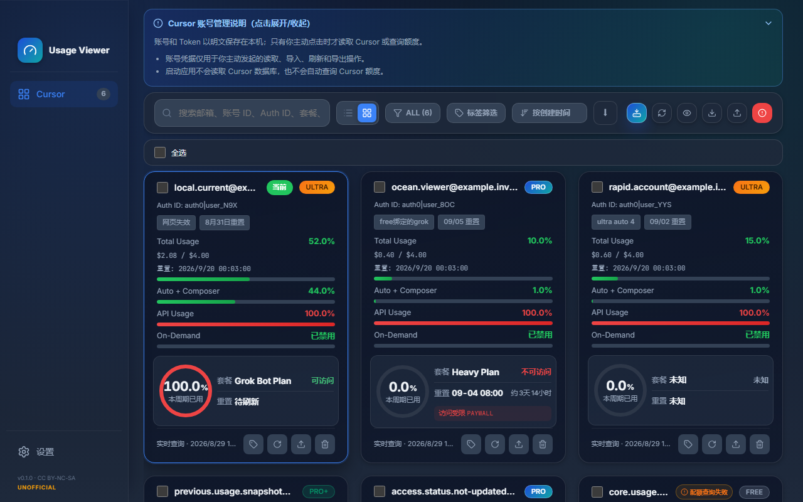
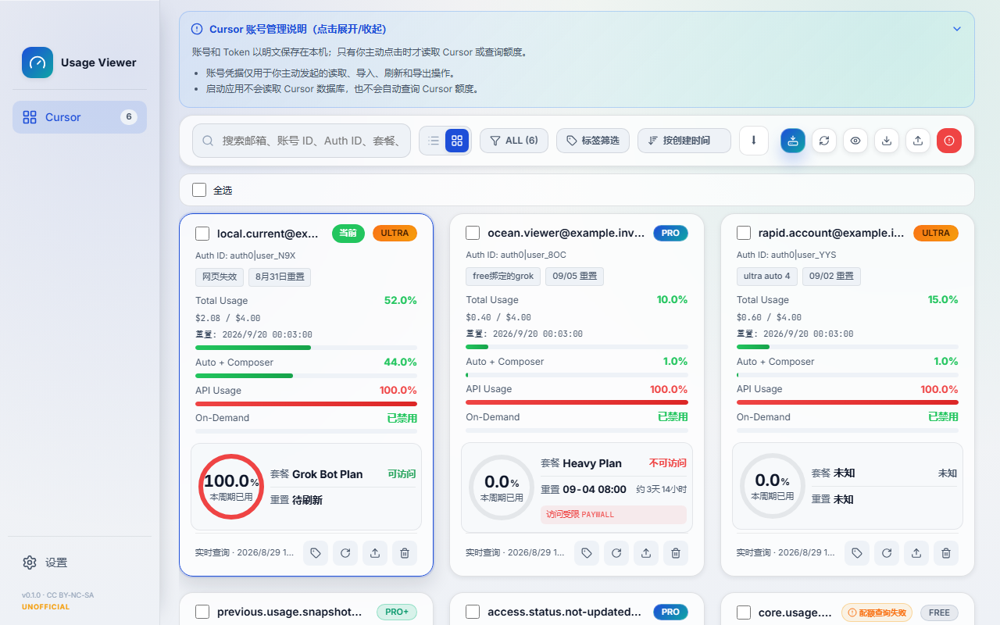

# Cursor Usage Viewer / Cursor 额度查看器

An unofficial, non-commercial source-available desktop workspace for viewing and managing Cursor account usage on Windows, macOS and Linux. It is not affiliated with or endorsed by Cursor or Anysphere.

一个非官方、非商业的公开源码桌面工具，用于在 Windows、macOS 和 Linux 管理多个 Cursor 账号并查看额度；与 Cursor / Anysphere 无隶属或背书关系。

## Features / 功能

- High-density cards for Total, Auto + Composer, API, On-Demand and Grok/Sand.
- Cockpit-compatible JSON paste import, local persistence, filtering, paging and full sensitive export.
- Cursor access happens only after the user clicks read or refresh; no background quota refresh.
- Signed stable updates with a Draft-first three-platform release process.
- 高密度额度卡、多账号粘贴导入、存盘恢复、筛选分页和完整敏感导出。
- 仅在用户点击后读取本机 Cursor 或查询额度；不后台刷新额度。

## Screenshots / 截图

Dark / 深色：



Light / 浅色：



## Security / 安全

Account details and `.bak` files contain plaintext Access and Refresh Tokens in the application data directory. Full export also contains plaintext credentials. There is no telemetry, cloud sync or remote logging. Cursor requests are restricted to the exact first-party endpoints documented in [SECURITY.md](SECURITY.md). App update traffic is separate and never carries Cursor credentials.

账号明细和 `.bak` 会在应用数据目录明文保存 Access / Refresh Token；完整导出同样包含明文凭据。项目不含遥测、云同步或远程日志。详细端点和数据流见 [SECURITY.md](SECURITY.md)。

## Development / 开发

```powershell
npm ci
npm test
npm run build
cargo +stable-x86_64-pc-windows-msvc test --manifest-path src-tauri/Cargo.toml
```

Tests use fake accounts, temporary directories, mock Cursor servers and isolated updater data. They must never read real Cursor data or use real credentials.

Maintainers should follow the fail-closed [release process](docs/RELEASING.md). Production owner and updater key material are configured only after explicit authorization.

## Install notes / 安装提示

The first release uses Tauri updater signatures but no Windows code-signing certificate or Apple notarization. SmartScreen or Gatekeeper may warn. Verify release checksums and attestations. Platform downloads will be listed here after the first stable release is published.

首版启用 Tauri updater 签名，但不购买 Windows 代码签名且不做 Apple notarization，因此可能出现 SmartScreen / Gatekeeper 提示。

## Cockpit-derived UI / Cockpit 派生界面

The Cursor account workspace, shared account controls, classic sidebar and light/dark themes are adapted from [jlcodes99/cockpit-tools](https://github.com/jlcodes99/cockpit-tools) at fixed commit `a0508ae815e104e931dae515389e680840008367`. This derivative removes unrelated providers and connects the adapted UI to this project's Cursor-only storage, usage and release systems. Grok/Sand is an additional fifth quota. Source paths and modifications are recorded in [THIRD_PARTY_NOTICES.md](THIRD_PARTY_NOTICES.md).

Cursor 账号工作区、共享账号控件、经典侧栏及深浅主题派生自上述固定版本的 Cockpit Tools；本项目删除其他 Provider，并把派生界面连接到 Cursor-only 的存储、额度和发布系统，另增加 Grok/Sand 第五额度。来源文件与修改记录见 [THIRD_PARTY_NOTICES.md](THIRD_PARTY_NOTICES.md)。

This project is licensed under **CC BY-NC-SA 4.0**: attribution is required, use is non-commercial only, and adaptations must be shared under the same license. 本项目采用 **CC BY-NC-SA 4.0**：必须署名、仅限非商业使用，衍生作品须以相同许可共享。Contributions are welcome; read [CONTRIBUTING.md](CONTRIBUTING.md) and report vulnerabilities privately as described in [SECURITY.md](SECURITY.md).
